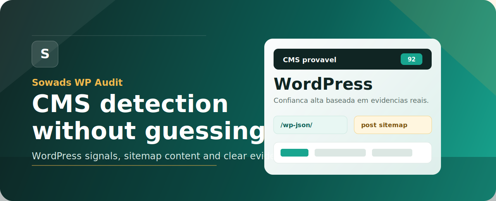

# Sowads WP Audit



<p align="center">
  <a href="https://github.com/caiorcastro/sowads-wp-audit">
    
  </a>
  
  
  
</p>

Extensão Chrome simples, rápida e com identidade visual alinhada à Sowads para identificar o CMS provável de um site, com foco especial em WordPress. Ela também faz uma leitura conservadora de sitemap para encontrar sinais reais de blog, artigos, notícias e conteúdo.

O princípio do projeto é direto: mostrar o que foi encontrado, deixar claro o nível de confiança e nunca inventar volume de posts ou CMS.

## Instalação Rápida

**Seguro por padrão:** o código é aberto, não tem build escondido, não usa dependências externas e pode ser auditado arquivo por arquivo neste repositório.

```text
1. GitHub -> Code -> Download ZIP
2. Descompacte a pasta
3. Chrome -> chrome://extensions/
4. Ative Modo do desenvolvedor
5. Carregar sem compactação -> selecione a pasta
6. Fixe o ícone da extensão na barra do Chrome
```

Se preferir terminal:

```bash
git clone https://github.com/caiorcastro/sowads-wp-audit.git
cd sowads-wp-audit
```

Depois carregue essa pasta em `chrome://extensions/` e fixe o ícone da extensão.

## Destaques

- Detecta WordPress como prioridade, mas também reconhece Shopify, Wix, Webflow, Squarespace, Drupal, Joomla, Magento, Ghost, HubSpot CMS, PrestaShop, Blogger, Duda e sinais de Next.js.
- Usa evidências reais: HTML, assets, DOM, cookies, headers, endpoints leves e sitemap público.
- Mostra pontuação e confiança para o CMS principal.
- Lista evidências para auditoria rápida.
- Verifica sitemaps sem inflar o número com páginas institucionais.
- Lista URLs reais de áreas de conteúdo encontradas na página, como blog, notícias, artigos, receitas e dicas.
- Segue poucos links claros de conteúdo para checar se o CMS está no blog e não na home.
- Não exige build, bundler, dependências ou servidor local.

## Interface

A extensão foi desenhada para uma leitura em menos de 10 segundos:

1. CMS provável no topo.
2. Pontuação de confiança ao lado.
3. Contexto curto do CMS detectado.
4. Bloco de sitemap com contagem conservadora de conteúdo.
5. Evidências que explicam o resultado.

O visual usa a cor principal da Sowads como protagonista: amarelo gema de ovo, contraste preto, cards limpos e hierarquia objetiva. A ideia é combinar com a narrativa da Sowads: estratégia, tecnologia, SEO, dados e operação.

## Conteúdo Via Sitemap

A extensão procura sitemaps públicos e classifica apenas URLs com sinal forte de conteúdo.

Ela também olha os links da página atual. Se a home tiver um link para `Blog`, `Notícias`, `Artigos`, `Receitas`, `Dicas`, `Guias`, `Insights` ou outra área clara de conteúdo, a extensão segue poucos candidatos e verifica esse destino também. Isso cobre casos em que o e-commerce da home usa uma plataforma e o blog roda em WordPress em outro subdomínio.

Exemplo: a home pode estar em uma plataforma de loja, mas apontar para `blog.exemplo.com.br`. Nesse caso, se o blog tiver sinais de WordPress, o resultado pode aparecer como `WordPress detectado no blog`, com as evidências marcadas como `blog/conteúdo`.

Quando encontra esses links, o popup mostra uma seção `Áreas de conteúdo encontradas` com URLs reais coletadas na página. Se alguma delas tiver CMS confirmado, o CMS aparece ao lado da URL.

Ela tenta:

- `Sitemap:` dentro de `robots.txt`;
- `/sitemap.xml`;
- `/sitemap_index.xml`;
- `/wp-sitemap.xml`;
- `/post-sitemap.xml`;
- `/article-sitemap.xml`;
- `/blog-sitemap.xml`;
- `/news-sitemap.xml`;
- alguns sitemaps filhos descobertos no sitemap principal.

Ela conta URLs quando:

- o sitemap filho parece ser de conteúdo, como `post`, `article`, `blog`, `news`, `noticia`, `insight`, `conteudo`, `materia` ou `wp-sitemap-posts-post`;
- ou a URL tem caminho claro de conteúdo, como `/blog/`, `/artigos/`, `/noticias/`, `/insights/`, `/conteudos/`;
- ou a URL usa padrão comum de post com data, como `/2025/04/nome-do-post`.

Ela ignora:

- páginas institucionais;
- produtos;
- categorias;
- tags;
- autores;
- anexos;
- carrinho;
- checkout;
- conta/login;
- políticas, termos, contato, sobre e serviços.

Importante: a contagem exibida não é uma estimativa do banco de dados. Ela representa somente URLs classificadas como conteúdo em sitemaps públicos durante a verificação rápida.

## CMS Detectados

| CMS ou plataforma | Principais sinais usados |
| --- | --- |
| WordPress | `/wp-content/`, `/wp-includes/`, `/wp-json/`, `api.w.org`, `wp-login.php`, `xmlrpc.php`, classes `wp-*`, cookies `wordpress_*` |
| Shopify | `window.Shopify`, `cdn.shopify.com`, headers Shopify, cookies `_shopify*` |
| Wix | `wixstatic.com`, `parastorage.com`, `window.wixBiSession`, headers Wix |
| Webflow | `data-wf-page`, `data-wf-site`, `window.Webflow`, `webflow.js` |
| Squarespace | `SQUARESPACE_CONTEXT`, `static1.squarespace.com`, headers Squarespace |
| Drupal | `drupalSettings`, `/sites/default/`, `/core/misc/drupal` |
| Joomla | `/administrator/`, `/media/system/`, `/templates/`, generator Joomla |
| Magento | `/static/frontend/`, `requirejs-config.js`, headers Magento |
| Ghost | `/ghost/`, generator Ghost |
| HubSpot CMS | `HubSpotConversations`, `hbspt`, `hs-scripts.com`, headers HubSpot |
| PrestaShop | generator PrestaShop, scripts e módulos PrestaShop |
| Blogger | `blogger.com`, `blogspot.com`, generator Blogger |
| Duda | `duda.co`, `multiscreensite.com` |
| Next.js | `/_next/static/`, `__NEXT_DATA__` como sinal de framework, não de CMS |

## Skills Necessárias

Este projeto junta algumas competências para entregar uma extensão útil sem virar uma ferramenta pesada.

| Skill | Por que importa |
| --- | --- |
| Chrome Extension Manifest V3 | Define permissões, popup, service worker e content script do jeito aceito pelo Chrome moderno. |
| JavaScript puro | Mantém a extensão leve, sem build e fácil de auditar. |
| Inspeção de DOM | Coleta sinais reais da página carregada, como metas, assets, classes e objetos globais. |
| Probes de rede | Consulta headers e endpoints públicos com timeout curto, sem travar a experiência. |
| Detecção de WordPress | Prioriza sinais fortes de WordPress e evita concluir com base em uma única pista fraca. |
| Fingerprinting de CMS | Reconhece padrões de Shopify, Wix, Webflow, Drupal, Joomla e outras plataformas. |
| Auditoria técnica de SEO | Usa sitemap e `robots.txt` para entender se existe conteúdo indexável. |
| UX writing | Explica incerteza, confiança e ausência de evidência sem exagero. |
| UI design | Entrega uma interface visualmente forte, mas simples para decisão rápida. |
| Performance | Limita requisições, URLs e sitemaps para manter tudo rápido. |
| Design de repositório GitHub | README com hero, badges, instalação, critérios, estrutura e roadmap. |

## Atualizar Depois De Mudanças

1. Abra `chrome://extensions/`.
2. Encontre `Sowads WP Audit`.
3. Clique no botão de recarregar da extensão.
4. Reabra ou atualize a aba que deseja auditar.

## Estrutura

```text
.
|-- assets/
|   `-- readme-hero.svg
|-- background.js
|-- content.js
|-- detector.js
|-- manifest.json
|-- popup.css
|-- popup.html
|-- popup.js
`-- README.md
```

## Como Funciona

O popup pede duas coletas:

1. `content.js` coleta sinais da página atual.
2. `background.js` coleta sinais de rede e sitemap.
3. `detector.js` combina as evidências, calcula pontuação e gera o resumo.
4. `popup.js` renderiza CMS principal, alternativas, sitemap e evidências.

O resultado é uma pontuação acumulada por CMS. Sinais fortes aumentam a confiança, sinais fracos aparecem como possibilidade e ausência de sinal não vira conclusão.

## Política De Verdade

A extensão deve ser conservadora.

- Se não encontrar CMS, mostra que não identificou.
- Se encontrar poucos sinais, marca como possível.
- Se encontrar sitemap sem URLs claras de conteúdo, não conta como blog.
- Se o site bloqueia endpoints, a extensão não assume que o CMS não existe.
- Se um site usa headless CMS ou CDN agressiva, o resultado pode ser inconclusivo.

## Testes Rápidos

Validações feitas no projeto:

```bash
node --check detector.js
node --check content.js
node --check background.js
node --check popup.js
node -e "JSON.parse(require('fs').readFileSync('manifest.json','utf8')); console.log('manifest ok')"
```

Também foram simulados sitemaps para garantir que:

- sitemap geral com `/servicos` e `/contato` não infla contagem;
- URLs em `/blog/` e `/noticias/` entram como conteúdo;
- `wp-sitemap-posts-post` conta posts mesmo sem `/blog/` no slug;
- `wp-sitemap-posts-page` não conta páginas como artigos.

## Roadmap

- Mostrar versão detectada quando houver evidência segura.
- Exportar resultado da auditoria em JSON.
- Criar modo "copiar resumo" para CRM ou planilha.
- Adicionar testes automatizados para o classificador de sitemap.
- Adicionar ícones oficiais da extensão em vários tamanhos.
- Publicar como release instalável.

## Licença

Projeto interno/experimental da Sowads. Defina uma licença antes de distribuir publicamente.
